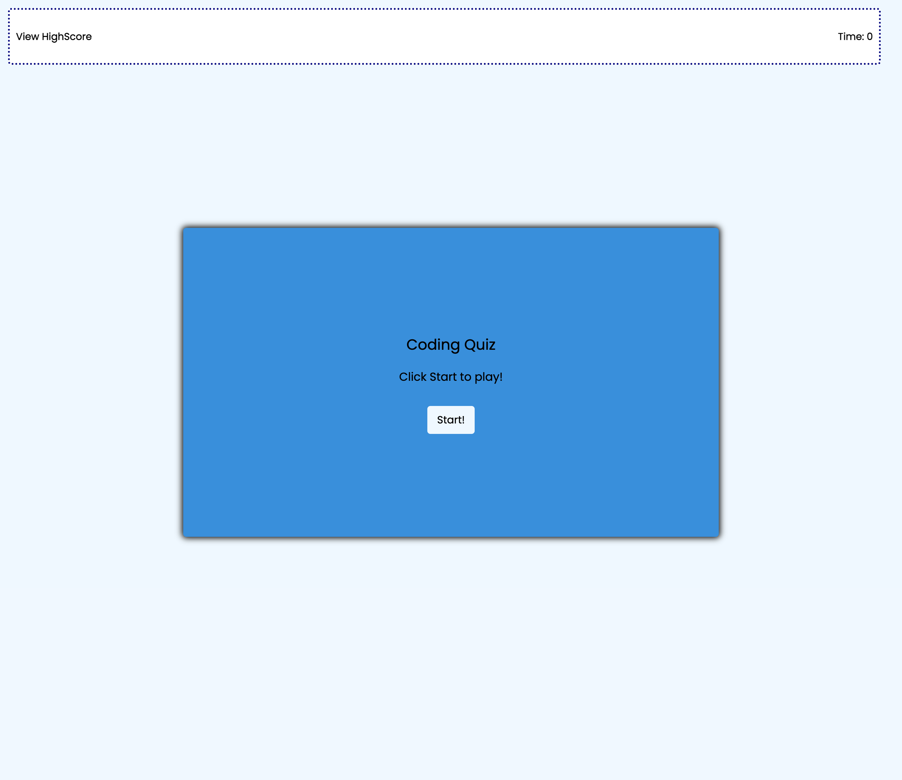
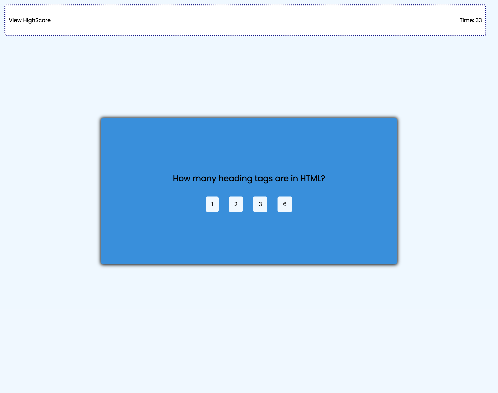
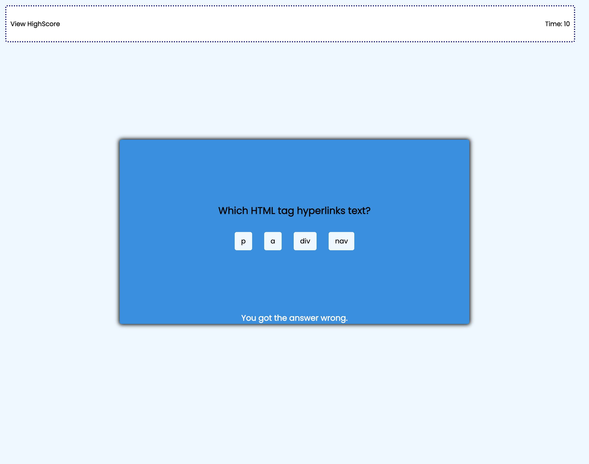
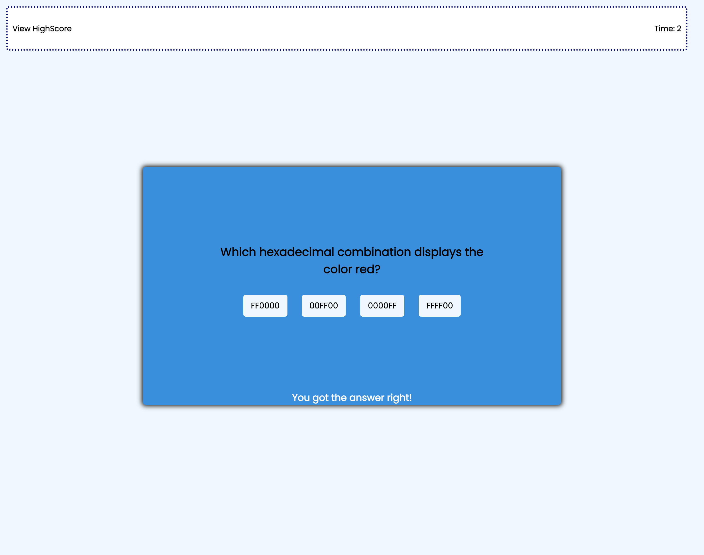
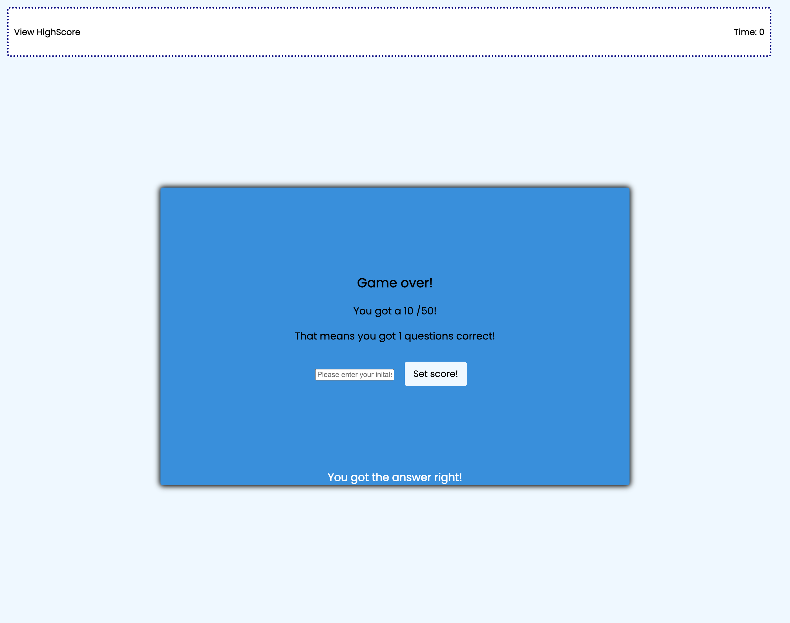
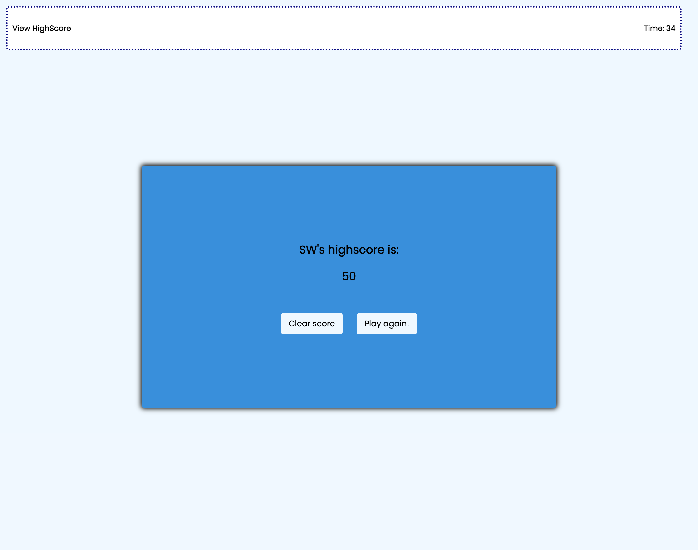

# 04 Web APIs Challenge: Code Quiz

In this assignment, I was tasked to create a functional quiz with a timer that gets deducted with wrong answers. This quiz uses HTML, CSS, and Javascript. The quiz uses Javascript to create questions and gather the users data to determine whether the answers to a question are correct, this then displays the users score and displays it in a high score screen. This assignment taught me a lot about how to create timers, use local storage, and how to access an object with a for loop. 

## User Story

AS A coding boot camp student

I WANT to take a timed quiz on JavaScript fundamentals that stores high scores

SO THAT I can gauge my progress compared to my peers

## Acceptance Criteria

GIVEN I am taking a code quiz

WHEN I click the start button

THEN a timer starts and I am presented with a question

WHEN I answer a question

THEN I am presented with another question

WHEN I answer a question incorrectly

THEN time is subtracted from the clock

WHEN all questions are answered or the timer reaches 0

THEN the game is over

WHEN the game is over

THEN I can save my initials and score

## Work Completed

*Creates a functional timer that ends the quiz at 0

*Adds points for correct answers

*Deducts time for wrong answers

*Uses the localstorage to store highscores and posts the highest score

*Adds on click to start game

*Uses a for loop to generate choice buttons

*Adds an object of questions the quiz will pull from

## Deployed Site

The deployed site hosted by GitHub.

https://scottwatt.github.io/Module4-CodeQuiz/

## Screenshot

### Full page

### Questions

### Wrong

### Correct 

### Game Over

### Highscore
